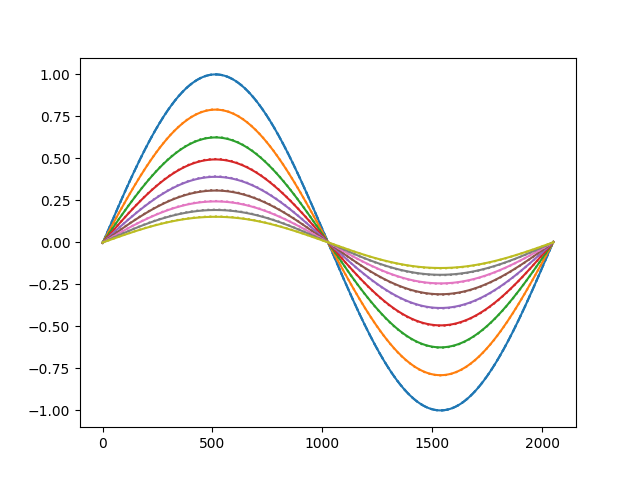
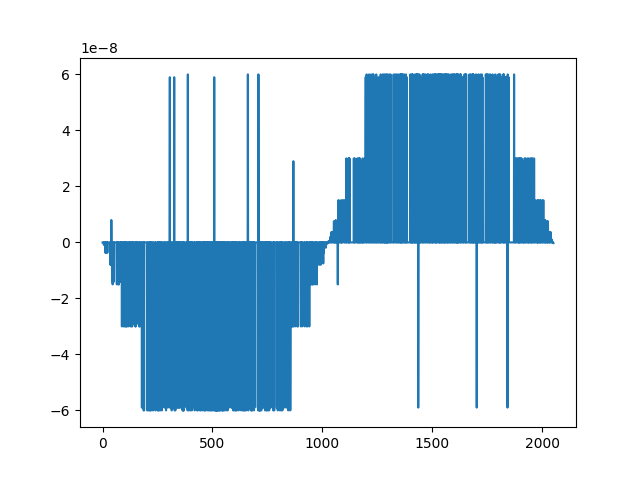
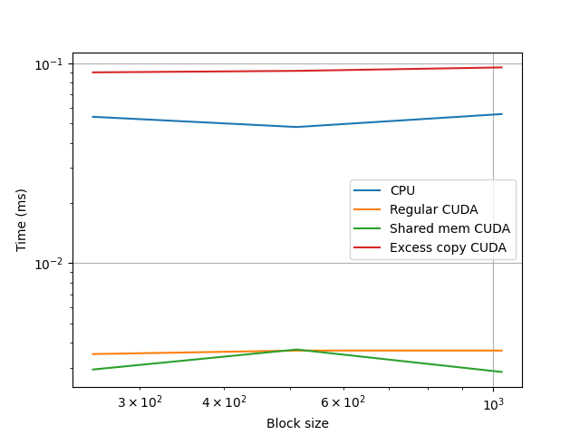

# Project 5: GPU Computing with CUDA

## Warm-up

In this project,  you will write 2 CUDA kernels for doing heat diffusion in one
dimension. The first kernel will be a naive implementation, the second kernel
will leverage CUDA shared memory. Be sure to watch and read the material in the [associated pre-class assignments](../schedule.md)! Then, as you are developing and running your CUDA code, refer to the following ICER documentation pages for using GPUs on HPCC:

- [Compiling for GPUs](https://docs.icer.msu.edu/Compiling_for_GPUs/)
- [Requesting GPUs](https://docs.icer.msu.edu/Requesting_GPUs/)

I strongly recommend using HPCC for this project.

## Part 1

Write a naive implementation of the heat diffusion approximation in
CUDA, using the `host_diffusion` routine in the `diffusion.cu` starter code  as a guide.

All the lines that you will need to change have been denoted with a FIXME. In
addition to writing the kernel, you will also need to handle the allocation of
memory on the GPU, copying memory to and from the GPU, launching the CUDA
kernel, and freeing the GPU memory. Remember to consider how large your domain
is vs. how many points your kernel needs to run on. To make things easier, you
can assume that the domain size minus `2*NG` will be divisible by the block
size, which will be divisible by 32.

These kernels will be easiest to debug by running only for 10 time steps. I've
included a python file to plot the difference between the host kernel and CUDA
kernel for the first time step. Any differences between the two should look
randomized and small. When you think you have your kernel working, you can run
it for 1000000 steps (since this simple implementation of heat diffusion
converges slowly).

I've also included a debugging function in the C version that you can use to
wrap your calls to the CUDA library, such as `checkCuda(cudaMemcpy(...));`. You
can see were I got this and some examples of how this is used
[here](https://github.com/parallel-forall/code-samples/blob/master/series/cuda-cpp/finite-difference/finite-difference.cu).
You need to activate this debugging function at compile time by executing 
`nvcc diffusion.cu -DDEBUG -o diffusion`.

The CUDA blog posts on finite difference in
[C/C++](https://devblogs.nvidia.com/finite-difference-methods-cuda-cc-part-1/)
might also be useful.

## Part 2

Rewrite your naive implementation of the heat diffusion kernel to first load
from global memory into a buffer in shared memory.

It will probably be useful to have separate indices to keep track of a thread's
position with it's shared memory block and within the entire array. You will
need extra logic to load in ghost zones for each block, and some calls to
`__syncthreads()`. When you get to calculating the diffusion in the kernel, all
memory loads should be from shared memory.

This kernel should give identical results to the `cuda_diffusion` kernel.

## Part 3

Time your naive implementation, the shared memory implementation, and a case
where memory is copied on and off the GPU for every time step.

Uncomment and fill in the code to test `shared_diffusion` but with copying data
to and from the GPU between every time step. This is closer to how CUDA is
sometimes used in practice, when there is a heavily used portion of a large
legacy code that you wish to optimize.

Increase your grid size to `2^15+2*NG` and change the number of steps you take
to 100. Run the program and take note of the timings. 

We can see that the diffusion over 1e6 timesteps progresses as we owuld expect:

Also we see that the errors between host and cuda are within acceptable limits

Running for 1e6 timesteps with a domain size of 2^11 we observe these timings with the -O3 flag:\
Host function took: 0.00333578ms per step \
Cuda Kernel took: 0.00211785ms per step\
Shared Memory Kernel took: 0.00213615ms per step\
Excessive cudaMemcpy took: 0.0196426ms per step\

And these timings without the -O3 flag: \
Host function took: 0.0150383ms per step\
Cuda Kernel took: 0.00201429ms per step\
Shared Memory Kernel took: 0.00203554ms per step\
Excessive cudaMemcpy took: 0.0170543ms per step \

These timings are in line with what we expect since shared vs global cuda memory doesn't matter very much at these scales. An interesting finding however is just how much faster the -O3 flag makes the CPU diffusion. On the other hand just as we expected the excessive memory copy cuda code is just as slow as the unoptimized CPU diffusion.

Now testing with a domain size of 2^15 and the optimization we see these timings:\
Host function took: 0.05409ms per step\
Cuda Kernel took: 0.0035072ms per step\
Shared Memory Kernel took: 0.0029344ms per step\
Excessive cudaMemcpy took: 0.0902954ms per step\

And without optimizing:\
Host function took: 0.241148ms per step\
Cuda Kernel took: 0.00358432ms per step\
Shared Memory Kernel took: 0.00294176ms per step\
Excessive cudaMemcpy took: 0.0919658ms per step\

Again we see the same trends as before except that we are approaching the scales where the shared memory is starting to become more efficient than the regular CUDA implementation.

Now testing with a block dimension of 512 we observe:\
Host function took: 0.048089ms per step\
Cuda Kernel took: 0.00365056ms per step\
Shared Memory Kernel took: 0.00369536ms per step\
Excessive cudaMemcpy took: 0.091873ms per step\

And with a block size of 1024:\
Host function took: 0.0558209ms per step\
Cuda Kernel took: 0.00365024ms per step\
Shared Memory Kernel took: 0.00285376ms per step\
Excessive cudaMemcpy took: 0.0955904ms per step\

\
Here we can observe the slight slowdowns when we go to higher block sizes. Furthermore the CPU with optimizations is better than the excess memory CUDA and if we parallized the CPU code we would expect to be even faster than the best CUDA implementation for this problem.

## What to turn In

Your code, well commented, and answers to these questions:

1. Report your timings for the host, naive CUDA kernel, shared memory CUDA kernel,
and the excessive memory copying case, using block dimensions of 256, 512,
and 1024. Use a grid size of `2^15+2*NG` (or larger) and run for 100 steps (or
shorter, if it's taking too long). Remember to use `-O3`! 

2. How do the GPU implementations compare to the single threaded host code. Is it
faster than the theoretical performance of the host if we used all the cores on
the CPU?

3. For the naive kernel, the shared memory kernel, and the excessive `memcpy` case,
which is the slowest? Why? How might you design a larger code to avoid this slow down?

4. Do you see a slow down when you increase the block dimension? Why? Consider
that multiple blocks may run on a single multiprocessor simultaneously, sharing
the same shared memory.
